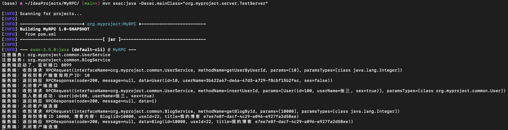
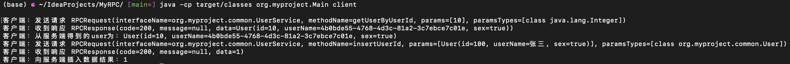

# MyRPC

```bash
MyRPC/
├── pom.xml
└── src
    └── main
        └── java
            └── org
                └── myproject
                    ├── client
                    │   └── RPCClient.java
                    ├── common
                    │   ├── User.java
                    │   └── UserService.java
                    └── server
                        ├── RPCServer.java
                        └── UserServiceImpl.java
```

构建 Maven 项目

```bash
mvn clean compile
```


## 启动服务端

```bash
mvn exec:java -Dexec.mainClass="org.myproject.server.RPCServer"
or
java -cp target/classes org.myproject.Main server
```

<div align="center"></div>


## 启动客户端

```bash
mvn exec:java -Dexec.mainClass="org.myproject.client.RPCClient"
or
java -cp target/classes org.myproject.Main client
```

<div align="center"></div>
