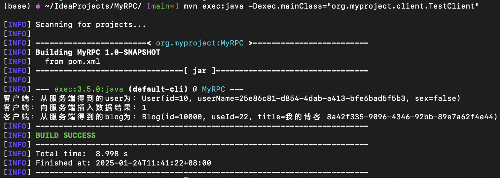

# MyRPC

```bash
MyRPC/
├── pom.xml
└── src
    └── main
        └── java
            └── org
                └── myproject
                    ├── Main.java
                    ├── client
                    │   ├── ClientProxy.java
                    │   └── RPCClient.java
                    ├── common
                    │   ├── RPCRequest.java
                    │   ├── RPCResponse.java
                    │   ├── User.java
                    │   └── UserService.java
                    ├── io
                    │   └── IOClient.java
                    └── server
                        ├── RPCServer.java
                        └── UserServiceImpl.java
```

1. 公共模块 (common 包)
   * `User.java` 一个简单的POJO（Plain Old Java Object），表示用户信息。
   * `UserService.java` 定义了用户服务接口，列出客户端可以调用的方法。
   * `RPCRequest.java` 定义了RPC请求的消息格式，包含需要调用的服务接口和方法信息。
   * `RPCResponse.java` 定义了RPC响应的消息格式，包含调用结果和状态信息。
2. 服务端模块（server 包）
   * `UserServiceImpl.java` UserService接口的具体实现类，提供业务逻辑。
   * `RPCServer.java` 负责监听客户端请求，处理RPCRequest，并返回RPCResponse。
3. 客户端模块（client 包）
   * `IOClient.java` 底层负责与服务器通信，发送RPCRequest并接收RPCResponse。
   * `ClientProxy.java` 使用动态代理封装RPC调用，使得客户端调用看起来像是本地方法调用。
   * `RPCClient.java` 客户端主类，使用代理对象调用远程服务的方法。


构建 Maven 项目

```bash
mvn clean compile
# 详细调试日志
mvn clean compile -e -X
```


## 启动服务端

```bash
mvn exec:java -Dexec.mainClass="org.myproject.server.RPCServer"
or
java -cp target/classes org.myproject.Main server
```

<div align="center"></div>


## 启动客户端

```bash
mvn exec:java -Dexec.mainClass="org.myproject.client.RPCClient"
or
java -cp target/classes org.myproject.Main client
```

<div align="center"></div>
